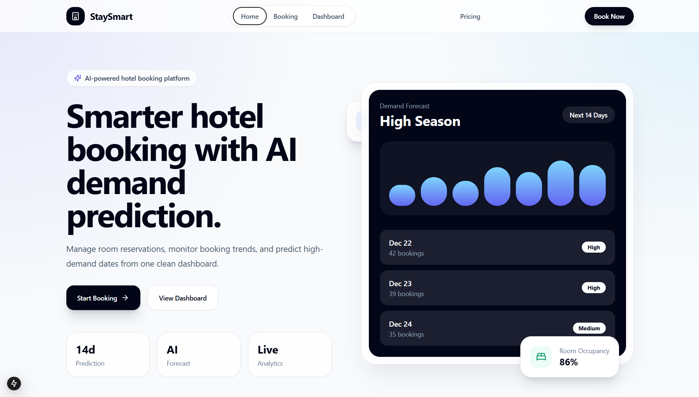
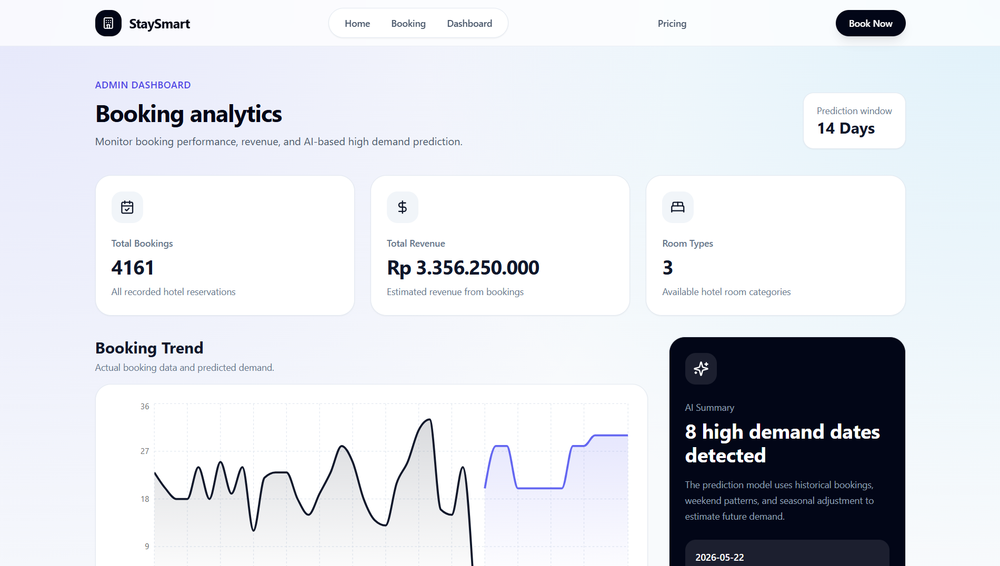
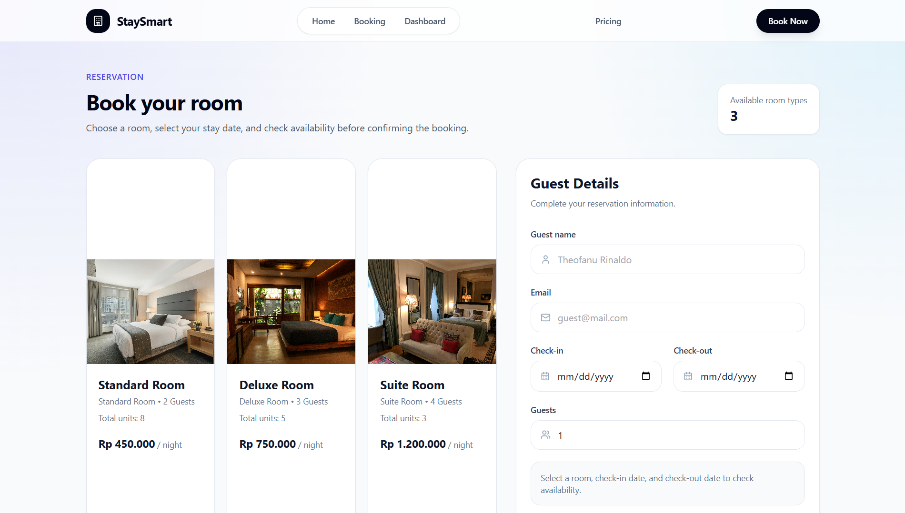

<div align="center">

# 🏨 StaySmart

**Modern Hotel Booking Platform with AI-Inspired Business Features**

Built with Next.js, Node.js, Express.js, and PostgreSQL

[](#license)
[](#)
[](#)
[](#)

</div>

---

## 📖 About

StaySmart is a full-stack hotel reservation platform that demonstrates a complete booking workflow combined with AI-inspired business features such as **demand prediction**, **dynamic pricing**, and **real-time room availability checking**.

This project was built as a portfolio application to showcase full-stack development skills, REST API design, database management, and business-oriented system architecture.

---

## 🖼️ Screenshots

<div align="center">

**Landing Page**



**Booking Page**



**Admin Dashboard**



</div>

---

## ✨ Features

### 👤 Guest Features
- Browse hotel rooms
- View detailed room information
- Real-time room availability checking
- Make online reservations
- Booking confirmation

### 🛠️ Admin Features
- Booking management
- Update booking status
- View booking history
- Dashboard analytics
- Revenue summary
- Room occupancy monitoring

### 🤖 AI-Based Features
- Demand prediction based on booking history
- Weekend demand adjustment
- Seasonal demand adjustment
- Dynamic pricing based on predicted demand

### 📊 Dashboard
- Total bookings
- Revenue overview
- Room statistics
- Booking trends
- Demand prediction summary
- Dynamic pricing summary

---

## 🧰 Technology Stack

| Layer | Technologies |
|---|---|
| **Frontend** | Next.js, React, TypeScript, Tailwind CSS, Recharts, Lucide React |
| **Backend** | Node.js, Express.js |
| **Database** | PostgreSQL |

---

## 📁 Project Structure

```
StaySmart/
├── frontend/
│   ├── app/
│   ├── components/
│   ├── public/
│   ├── styles/
│   └── package.json
│
├── backend/
│   ├── server.js
│   ├── seed.js
│   ├── routes/
│   ├── database/
│   └── package.json
│
└── README.md
```

---

## 🧩 Application Modules

- Landing Page
- Room Listing
- Booking System
- Booking Availability Checker
- Admin Dashboard
- Booking Management
- Analytics Dashboard
- AI Demand Prediction
- Dynamic Pricing

---

## 🗄️ Database Schema

### `rooms`

| Column | Type |
|---|---|
| id | Serial (PK) |
| name | Varchar(100) |
| type | Varchar(50) |
| price | Integer |
| capacity | Integer |
| image_url | Text |
| total_units | Integer  |

### `bookings`

| Column | Type |
|---|---|
| id | Integer |
| guest_name | Text |
| guest_email | Text |
| room_id | Integer |
| checkin_date | Date |
| checkout_date | Date |
| guests | Integer |
| status | Text |
| created_at | Timestamp |

---

## 🔌 API Endpoints

### Rooms
```http
GET /api/rooms
```
Returns all available rooms.

### Booking
```http
POST /api/bookings
```
Creates a new booking.

### Room Availability
```http
GET /api/availability?room_id={id}&checkin_date={date}&checkout_date={date}
```
Returns room availability for the selected dates.

**Query Parameters**

| Parameter | Type | Description |
|---|---|---|
| `room_id` | Integer | Target room ID |
| `checkin_date` | Date | Check-in date |
| `checkout_date` | Date | Check-out date |

### Dashboard
```http
GET /api/dashboard
```
Returns booking statistics and analytics.

### Dynamic Pricing
```http
GET /api/dynamic-pricing
```
Returns room prices adjusted by the demand prediction engine.

### Admin
```http
GET /api/admin/bookings
```
Returns all bookings.

```http
PATCH /api/admin/bookings/:id/status
```
Updates booking status.

---

## 🧠 AI Demand Prediction

The current prediction engine uses a **rule-based forecasting approach** that considers:

- Historical booking volume
- Weekend demand
- Seasonal demand

The system architecture allows future integration with machine learning models such as:

- Prophet
- XGBoost
- Random Forest
- LSTM

...without requiring frontend changes.

---

## 💰 Dynamic Pricing

The pricing engine adjusts room prices based on predicted booking demand.

| Demand Level | Price Adjustment |
|---|---|
| Low | Base Price |
| Medium | Base Price + 10% |
| High | Base Price + 25% |

---

## 📅 Room Availability

Before a reservation is created, the system checks:

- Existing bookings
- Booking overlap
- Room inventory
- Booking status

Reservations are only accepted if rooms are available.

On the booking page, availability is checked automatically in real time: as soon as a room, check-in date, and check-out date are all selected, the frontend calls `GET /api/availability` and displays the result (available / not available units) before the guest can confirm the booking.

---

## 🚀 Installation

### 1. Clone the Repository
```bash
git clone https://github.com/yourusername/staysmart.git
cd staysmart
```

### 2. Setup Backend
```bash
cd backend
npm install
npm run dev
```

### 3. Setup Frontend
```bash
cd frontend
npm install
npm run dev
```

---

## 🔐 Environment Variables

### Backend — `.env`
```env
DB_HOST=localhost
DB_PORT=5432
DB_USER=postgres
DB_PASSWORD=yourpassword
DB_NAME=staysmart
PORT=5000
```

### Frontend — `.env.local`
```env
NEXT_PUBLIC_API_URL=http://localhost:5000
```

> ⚠️ Never commit `.env` files to version control. Use a `.env.example` file to document required variables instead.

---

## 🗺️ Future Improvements

- [ ] JWT Authentication
- [ ] Payment Gateway Integration
- [ ] Email Notifications
- [ ] Multi-Hotel Support
- [ ] Recommendation System
- [ ] Machine Learning Demand Prediction
- [ ] Customer Reviews
- [ ] Image Upload
- [ ] Cloud Storage Integration
- [ ] Mobile Application
- [ ] Role-Based Access Control

---

## 🎯 Purpose

StaySmart was built to demonstrate practical experience in:

- Full-Stack Web Development
- REST API Development
- PostgreSQL Database Design
- Modern UI Development
- Business Logic Implementation
- AI-Based Feature Integration
- Dashboard and Data Visualization

The project is intended as a portfolio application for Full Stack Developer positions and freelance web development projects.

---

## 📄 License

This project is licensed under the **MIT License**.

---

## 👨‍💻 Author

**Theofanu Rinaldo Santoso**
Full Stack Developer

**Tech:** Next.js · React · TypeScript · Node.js · Express.js · PostgreSQL · Tailwind CSS · REST API